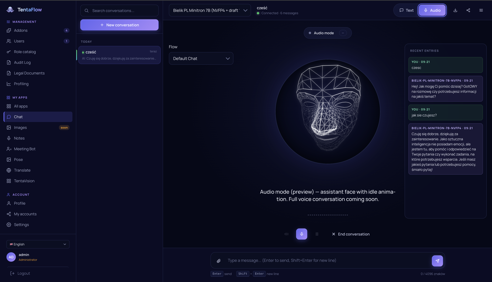
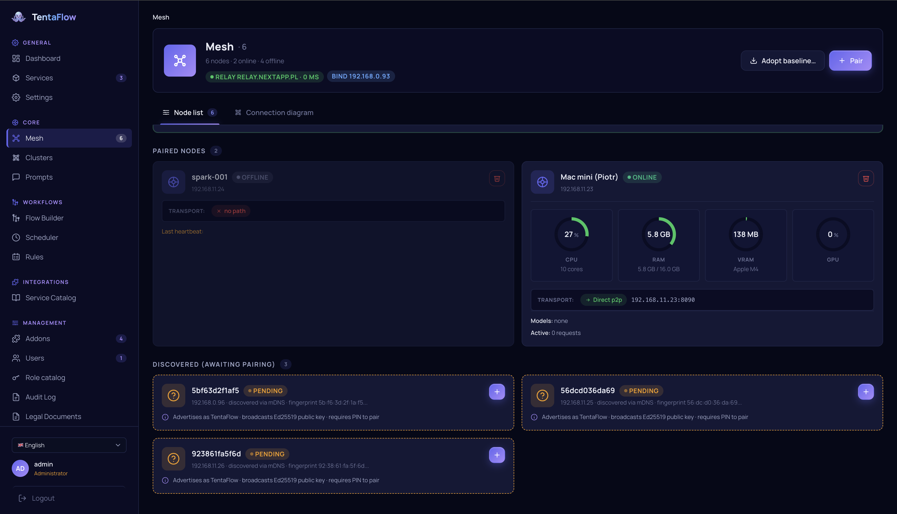
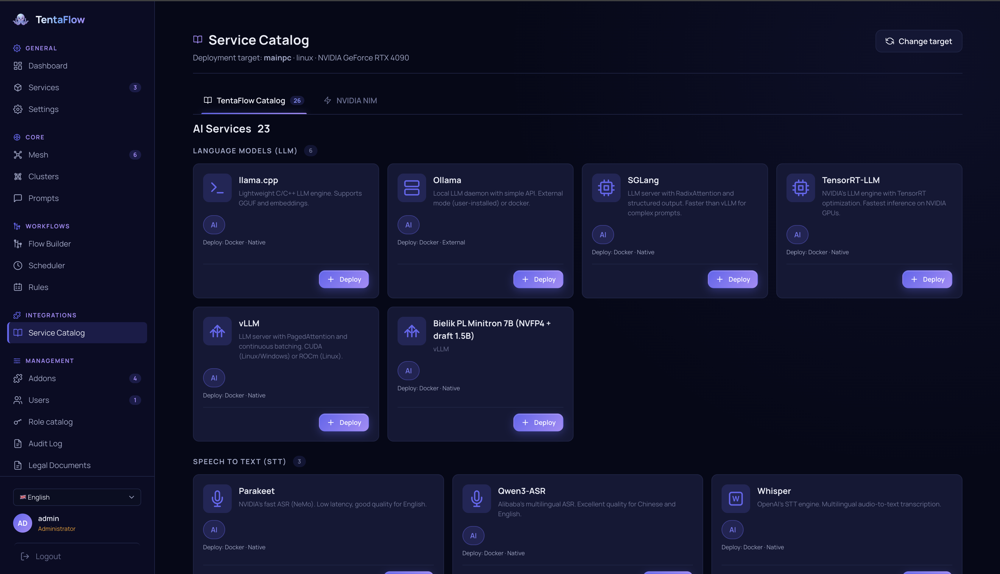
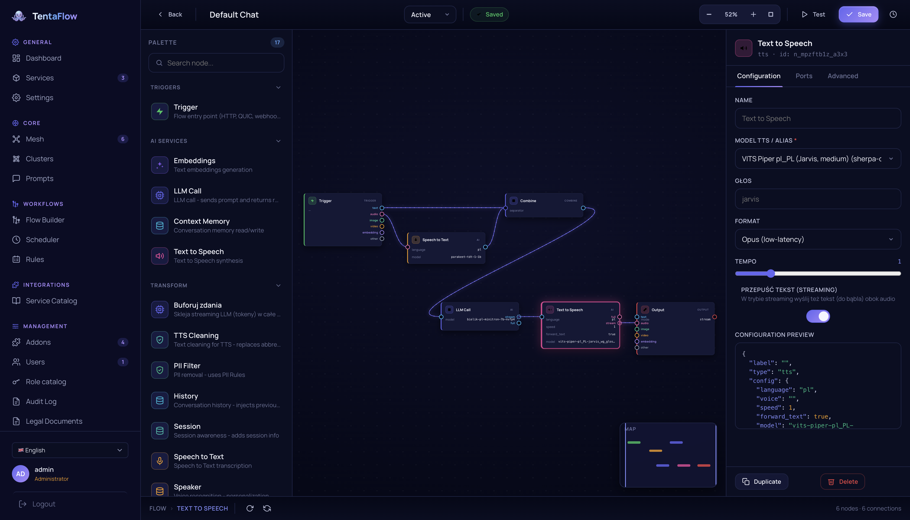
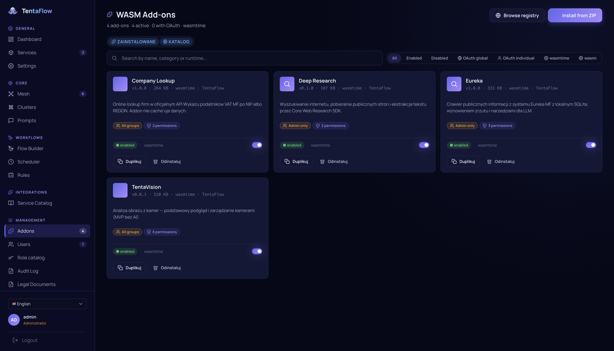

<div align="center">


# TentaFlow

**An operating system for your AI.**

Turn every device you own - a GPU server, your laptop, your phone - into one private AI mesh.
Deploy models anywhere, wire them into flows, and let TentaFlow pick the right model automatically:
the big one on the server when you're connected, the local one on your phone when you're not.


</div>

---

## What is TentaFlow?

Most AI tools assume one machine, one model, and a cloud account. TentaFlow assumes the opposite:
you already have several devices with very different capabilities, and you want them to work together
as **one private AI system that you fully own**.

TentaFlow is the layer that makes that happen. It is a single Rust application that runs on Linux,
macOS, Windows, Android and iOS, and turns each device into a **node** in a peer-to-peer mesh.
A node can be a rack server with four GPUs, a MacBook, or a phone in your pocket - they all speak the
same protocol, share the same data, and expose the same capabilities.

On top of that mesh you:

- **Deploy models to any device** - run a 70B model on the GPU box and a small one on the phone, all from the same dashboard.
- **Build flows visually** — chain LLMs, speech, vision, memory and tools into multi-step pipelines with the **Flow Builder**, no code required.
- **Define aliases with automatic fallback** - point your app at `assistant`, and TentaFlow uses the powerful server model when it's reachable and silently falls back to a local laptop/phone model when it isn't.
- **Extend everything with addons** - sandboxed plug-ins (with their own UI) that add tools, integrations and data sources, written against an SDK.

And because the whole thing also runs **fully offline on a phone**, you get the exact same product whether
you're online with a server farm or on a plane with nothing but your handset.

<p align="center"></p>

---

## The core ideas

### 🐙 One mesh, many devices

Every device runs the same node. Nodes find each other automatically over **iroh** (QUIC with relay,
DHT and LAN discovery), so they connect across the same Wi-Fi *or* across the internet without manual
port-forwarding. First contact is a simple **6-digit PIN pairing** with Ed25519 key verification — once
two nodes are paired they trust each other.

A request sent to any node can be served by a service running on *any other* node: the mesh routes it
transparently, including multi-hop relays for peers that aren't directly connected. Your phone can use the
LLM on your server as if it were local.

State (your flows, settings, identities, RBAC, addon data) is kept consistent across the mesh by an
embedded **Sync Ledger** - an append-only, hash-chained operation log with per-node cursors, outbox/inbox
and snapshots. Sync is permission-gated: a node only receives the resources it's allowed to.

<p align="center"></p>

### 🚀 Deploy any model to any node

TentaFlow runs models locally through several inference backends, and connects to external engines as
managed services:

| Capability | Backends |
|------------|----------|
| **LLM** | llama.cpp (CPU/GPU), Apple **MLX** (Metal), plus external **vLLM / SGLang / Ollama** as mesh services |
| **Speech-to-text** | Whisper, sherpa-onnx, MLX-Whisper (Apple) |
| **Text-to-speech** | sherpa-onnx, Kokoro (MLX), Apple AVSpeech, Supertonic (ONNX) |
| **Embeddings** | local embedding models, served per node |
| **Vision** | face detection (YOLOv8 / SCRFD), pose, emotion — embedded ONNX, runs on CPU |
| **Speaker diarization** | pure-Rust VAD + speaker embeddings (`tentaflow-voice`) |

GPU acceleration is available for llama.cpp and Whisper via CUDA, Vulkan, ROCm and Metal. A built-in
**vector database** (`tentaflow-zvec`, embedded on every platform) powers semantic search, RAG and
long-term memory.

<p align="center"></p>

### 🔀 Flows: compose AI like building blocks

The **Flow Builder** is a visual, node-based editor (a typed DAG) for turning models and tools into
real pipelines - transcribe -> summarize -> translate -> speak, or trigger -> retrieve from memory ->
LLM -> filter PII -> output. Node types include:

`trigger` · `llm` · `vision_llm` · `stt` · `tts` · `embeddings` · `memory` ·
`conversation_history` · `condition` · `pii_filter` · `combine` · `sentence_buffer` ·
`output` · and dynamic `addon.*` blocks contributed by addons.

Flows run in two modes: **blocking** (full DAG, nodes run concurrently as their inputs become ready)
and **streaming** (token-by-token for LLM chat). Every flow is validated on save.

<p align="center"></p>

### 🎯 Aliases with automatic fallback

This is the feature that makes a multi-device mesh actually pleasant to use.

An **alias** is a stable name (e.g. `assistant`, `coder`, `transcriber`) that points at a *primary* model
plus an ordered list of *fallback* models. Your apps and flows only ever reference the alias:

```
alias "assistant"
  ├─ primary:   qwen-72b           (on the GPU server)
  └─ fallback:  phi-3-mini-local   (on this laptop / phone)
```

At request time TentaFlow resolves the alias against what's actually reachable right now. It prefers a
**locally deployed** model over a remote one, walks the fallback chain on transport failures, and only
surfaces an error if *every* candidate is unreachable. So when you're at your desk you get the big server
model; when you walk away and lose the connection, the same `assistant` keeps working on-device - no code
change, no reconfiguration. Every resolution is audited (which target was used, whether a fallback kicked in).

### 🧩 Addons: extend everything, in your language

Addons are **sandboxed WebAssembly plug-ins** (WASM/WASI, run via Wasmtime on desktop, wasmi on mobile).
They add tools, data sources, Flow blocks and even **their own dashboard panels** - the UI is described
declaratively (a CBOR component tree of ~150 building blocks) and rendered natively by the host on web,
iOS and desktop.

There is a real **SDK** with host capabilities exposed through clean wrappers:

- LLM generate / stream / embeddings · per-addon **SQLite** and key-value storage
- outbound **HTTP** (fail-closed: admin must approve each network rule) · **web research** (search + readable-page extraction)
- events, timers, encrypted secrets, camera access, model aliases, and a typed UI builder

All SDK types come from a single source-of-truth spec (`tentaflow-sdk-spec`) and the SDKs are **generated
for Rust, C# and Python** (`tentaflow-sdk-gen`) - so addons aren't locked to one language. 

<p align="center"></p>

### 📱 The same product, fully offline

The mobile build (Android via JNI, iOS via a Swift bridge) is **not a thin client** - it's the whole node:
local inference, the flow engine, addons, the sync ledger and the dashboard, all on-device. Pair it with
your other nodes to share their models, or run it standalone on a plane. Same capabilities either way.

---

## More that's built in

- **Web dashboard** - a fast vanilla-JS SPA on port `8090` with 20+ views (chat, playground, services,
  mesh, models, flows, addons, scheduler, audit, users, compliance, profiling…). It never uses REST — it
  talks to the core over a binary CBOR protocol.https://github.com/Slyb00ts/TentaFlow
- **OpenAI-compatible API** — `POST /v1/chat/completions`, `/v1/audio/*`, `/v1/embeddings` for external
  apps that want to use your TentaFlow models, authenticated with an API key.
- **Compliance core (GDPR/RODO)** - built-in AI audit, retention policies, ROPA, DSAR, consents, DPIA and
  a breach register, with every AI call linked into a tamper-evident audit chain.
- **Scheduler** - run addon tools on a cron / interval / one-shot schedule.
- **Camera & vision pipeline** - ingest RTSP/ONVIF/local cameras (GStreamer) and run on-frame face, pose
  and emotion models.
- **Web research for addons** - pluggable search providers (SearXNG, Brave, Tavily, DuckDuckGo) and a
  SSRF-guarded readable-page reader, optionally backed by a headless-Chromium renderer service.
- **Service containers** - ship engines like SearXNG or the browser renderer as Docker images *or* native
  Python bundles, deployable to a node from the dashboard.

## Security

- **TLS 1.3 everywhere** (client↔node and node↔node), AEAD ciphers only in production.
- **Ed25519** node identities, key-verified pairing, HMAC (constant-time) on REST integration endpoints.
- **WASM sandbox** isolation for addons; host functions are fail-closed and require admin-approved permissions.
- **Argon2id** password hashing, JWT for the dashboard, API keys for the OpenAI endpoint.
- Per-IP + global rate limiting, full audit logging, path-traversal containment, unconditional HSTS.

---

## Architecture at a glance

```
                          ┌───────────────── MESH (iroh / QUIC, encrypted) ─────────────────┐
                          │                                                                  │
   ┌──────────────┐       │   ┌──────────────┐        ┌──────────────┐      ┌────────────┐  │
   │  GPU server  │◄──────┼──►│   Laptop     │◄──────►│    Phone     │◄────►│   Server   │  │
   │  vLLM 72B    │       │   │  llama.cpp   │  multi │  MLX small   │      │  Whisper   │  │
   │  embeddings  │       │   │  flows       │  hop   │  offline ok  │      │  vision    │  │
   └──────────────┘       │   └──────────────┘        └──────────────┘      └────────────┘  │
                          │            ▲  Sync Ledger (state) · alias resolution · routing   │
                          └────────────┼─────────────────────────────────────────────────────┘
                                       │
              ┌────────────────────────┼────────────────────────┐
              │ binary CBOR (dashboard/SDK)   REST /v1/* (external apps, OpenAI-compatible)
        ┌─────┴─────┐            ┌──────┴──────┐
        │ Dashboard │            │  Your app   │
        │   (SPA)   │            │ (any lang)  │
        └───────────┘            └─────────────┘
```

### Crates

| Crate | Purpose |
|-------|---------|
| `tentaflow` | Main binary — mesh node + API gateway |
| `tentaflow-core` | The engine — networking, mesh, sync, routing, auth, inference, flows, addons, API, dashboard |
| `tentaflow-protocol` / `-wasm` | Wire protocol (CBOR) + browser WASM glue |
| `tentaflow-transport` | Transport layer |
| `tentaflow-desktop` | Native desktop app (egui/wgpu) with system tray |
| `tentaflow-mobile` | Mobile runtime — Android (JNI) + iOS (Swift bridge) |
| `tentaflow-voice` | Pure-Rust VAD + speaker embeddings (diarization) |
| `tentaflow-zvec` / `-sys` | Embedded vector database |
| `tentaflow-containers` | Service container definitions (Docker + native bundles) |
| `tentaflow-sdk-spec` / `-gen` | Addon SDK type spec + Rust/C#/Python code generators |
| `tentaflow-ui` / `-ui-schema` | Shared UI framework + declarative addon-UI schema |
| `tentaflow-client` | Client SDKs — native Rust FFI + .NET wrapper |
| `tentaflow-models` | Training pipeline for the orchestrator model |
https://github.com/Slyb00ts/TentaFlow
---

## Getting started

### Prerequisites

**Ubuntu / Debian:** `sudo apt install build-essential pkg-config libssl-dev`
**Fedora / RHEL:** `sudo dnf install gcc pkg-config openssl-devel`
**Arch:** `sudo pacman -S base-devel pkg-config openssl`
**macOS:** `brew install openssl pkg-config`

The dashboard's browser protocol glue needs two WASM targets and a pinned `wasm-bindgen`:

```bash
rustup target add wasm32-wasip1            # sandboxed addons
rustup target add wasm32-unknown-unknown   # browser protocol glue
cargo install wasm-bindgen-cli --version 0.2.125 --locked   # MUST match the pinned crate
```

> Without `wasm-bindgen`, `build.rs` skips `www/js/protocol/wasm_glue.{js,wasm}` and the dashboard won't load.

**One-shot setup** (Linux + macOS) handles toolchain, both targets and `wasm-bindgen`:

```bash
./scripts/setup.sh
```

> On macOS 26+ (Xcode 26) the Metal compiler is a separate component. Without it, MLX models return
> gibberish with no build error — `setup.sh` installs it and `build.rs` fails loudly if it's missing.

TLS certs are generated automatically on first build (self-signed EC P-256, pure Rust via `rcgen`);
drop your own into `certs/cert.pem` + `certs/key.pem` to override.

### Build & run

```bash
cd tentaflow && cargo build --release --features gpu-cuda
./target/release/tentaflow --config ../config.toml
```

Open the dashboard at **https://localhost:8090**.

Useful `tentaflow-core` features: `inference-llamacpp`,
`inference-whisper` (default), `inference-sherpa`, `inference-mlx*` (Apple), `inference-diarization`,
`gpu-cuda`, `docker`.

### Configuration

A single TOML file passed with `--config`. Main sections: `[server]`, `[server.mtls]`,
`[protocols.quic]`, `[mesh]`, `[load_balancing]`, `[monitoring]`. Default HTTPS/QUIC port **8090**.

---

## License

Apache 2.0 — Copyright 2026 Slyb00ts. See [LICENSE](LICENSE).
