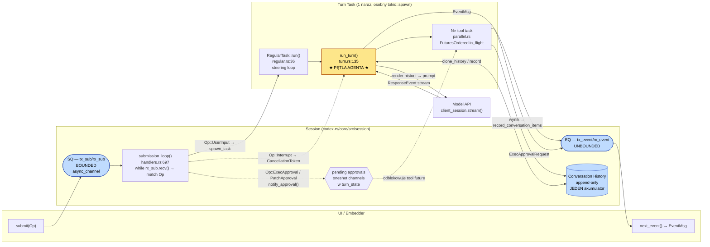
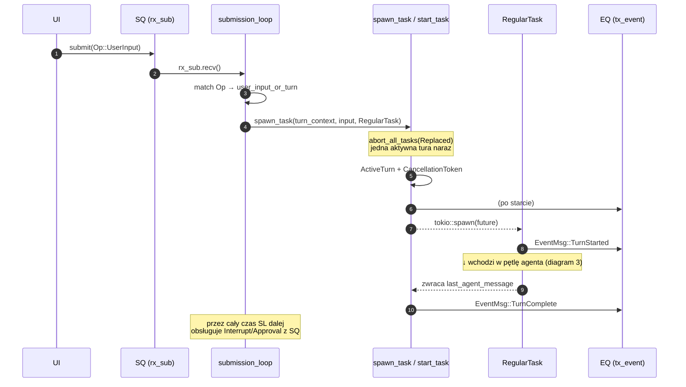
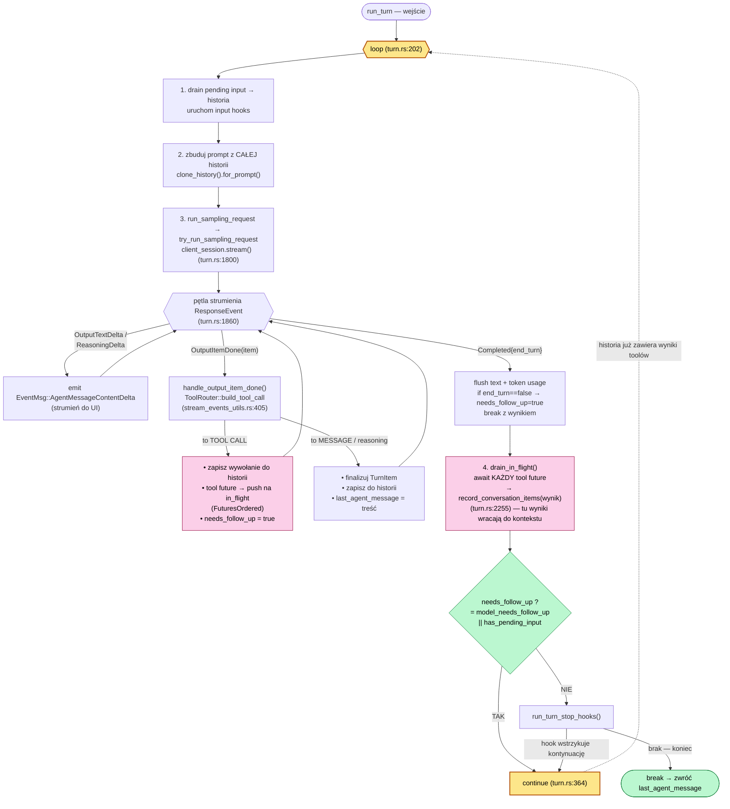
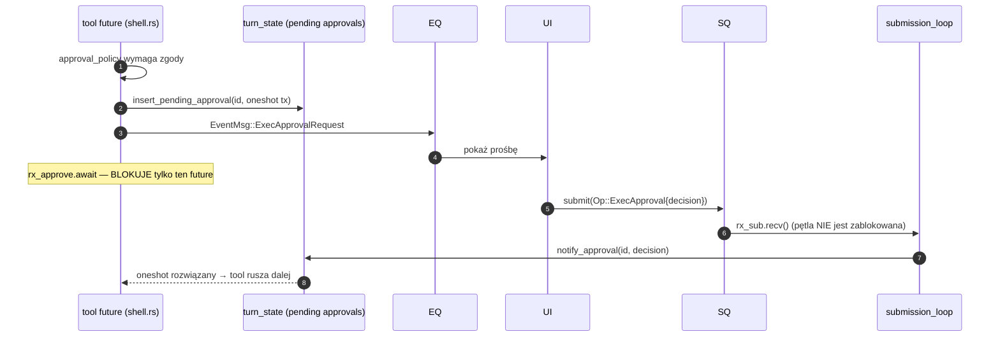

# Codex CLI — wewnętrzna architektura harnessu (Rust core)

> Źródło: `github.com/openai/codex`, commit `f4278010`, crate `codex-rs/core/`.
> Cel: zrozumieć, jak codex robi **pętlę agenta bez subflowów** — pojedynczy `loop { ... continue }`
> nad jedną, narastającą historią konwersacji. To wzorzec docelowy dla harnessu TentaFlow.

---

## 1. Widok komponentów — SQ/EQ (Submission Queue / Event Queue)

Cała komunikacja UI ↔ silnik idzie przez **dwa kanały**. Pętla submisji nigdy sama nie woła
modelu — tylko *spawnuje* turę jako osobny task Tokio, więc zostaje responsywna na kolejne
`Op` (przerwania, zatwierdzenia, „steering").

---

## 2. Pętla zewnętrzna — od `Op` do tury

---

## 3. ★ PĘTLA AGENTA ★ — iteracja tool-calli bez subflowów (`run_turn`, turn.rs:135)

To jest sedno. **Jeden `loop`**, jeden akumulator (historia). Każda iteracja: renderuj historię →
streamuj model → wykonaj tool-calle jako nakładające się futures → dopisz ich wyniki do historii →
`continue`. Koniec tury, gdy sampling zwraca `needs_follow_up == false` (brak tool-calli, model
zakończył turę przez `end_turn`, brak „steered" inputu).

**Klucz dla TentaFlow:** model jest wołany ponownie przez zwykłe `continue` w jednym `loop`.
Brak rekurencji, brak sub-tasków per iteracja, brak „subflow". Jedyne `spawn`y to:
(a) jeden task na całą turę, (b) jeden task na *pojedyncze* wywołanie toola (równoległość),
zbierane z powrotem przez `in_flight` / `drain_in_flight` w **tej samej** iteracji.

---

## 4. Gating zatwierdzeń (approval / sandbox) — bez deadlocka

Zatwierdzenie blokuje **tylko future konkretnego toola**, nie pętlę. Bo tura biegnie na osobnym
tasku, a `submission_loop` dalej drenuje SQ i może dostarczyć decyzję.

---

## 5. Dwie warstwy „końca"

| Poziom | Sygnał | Plik |
|--------|--------|------|
| sampling pass | `SamplingRequestResult.needs_follow_up` (tool-call / RespondToModel / `end_turn==false` / pending input) | `turn.rs:1227` |
| tura | `run_turn` przerywa `loop`, gdy `!needs_follow_up` i stop-hooki nie żądają kontynuacji | `turn.rs:362` |
| sesja | `on_task_finished` → `EventMsg::TurnComplete`, czyści `active_turn` | `tasks/mod.rs:554` |

---

## 6. Model współbieżności (skrót)

- **1× submission loop** / sesja — drenuje SQ, dispatchuje `Op`, **nigdy** nie woła modelu.
- **1× turn task** naraz — `ActiveTurn` + `CancellationToken`; nowa tura abortuje starą (`Replaced`).
- **N× tool task** / sampling pass — `tokio::spawn` per tool, zbierane przez `FuturesOrdered`;
  równoległość bramkowana `RwLock` (`parallel_execution`).
- **EQ unbounded** dla `EventMsg`; **oneshot** per zatwierdzenie/prośba o input.
- Sama iteracja agentowa = **jeden `loop` + `continue`** nad append-only historią.
