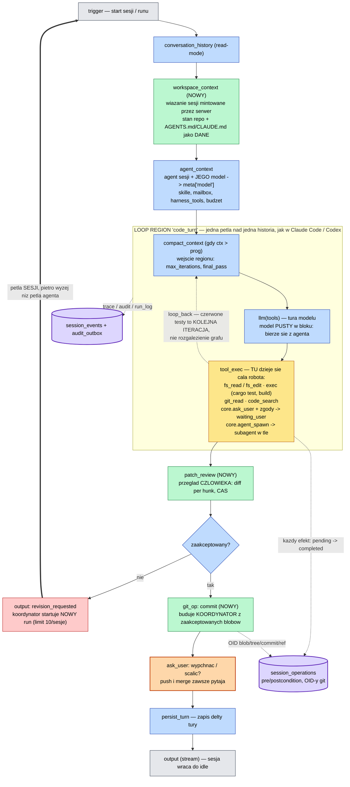

# Code Harness — graf harnessu

Diagram poglądowy. Konwencja jak w `docs/target-agent-flow.mmd`. Źródło: `docs/code-harness-flow.mmd`.

## Zasada podziału: co jest w pętli, a co poza nią

**W pętli jest wszystko, co agent może zrobić i powtórzyć.** Czytanie i edycja plików, uruchamianie
testów i buildów, wyszukiwanie, delegacja do subagenta, pytania do użytkownika i prośby o zgodę.
Czerwone testy nie są rozgałęzieniem grafu — agent dostaje wynik jako rezultat narzędzia, poprawia
kod i odpala je znowu. To kolejna iteracja tej samej pętli, dokładnie jak w Claude Code i Codeksie,
gdzie cały harness to jeden `loop` nad jedną narastającą historią (`docs/CODEX_HARNESS_INTERNALS.md`).

Pętla kończy się **strukturalnie**: gdy model przestaje wołać narzędzia. Nie ma warunku „testy
zielone?", bo to agent ma doprowadzić je do zieleni, zanim uzna robotę za skończoną.

**Poza pętlą zostaje tylko to, czego agentowi nie wolno zrobić samemu.** Przegląd zmian przez
człowieka, commit budowany przez koordynatora z zaakceptowanych blobów, wypchnięcie albo scalenie.
Trzy bloki — każdy dlatego, że wymaga kogoś innego niż agent, a nie dlatego, że tak wygląda porządniej.

Odrzucenie w przeglądzie nie wraca krawędzią wsteczną: kończy run jako `revision_requested`,
a koordynator startuje kolejny z uwagami. To **pętla sesji**, piętro wyżej niż pętla agenta —
rdzeń i tak odrzuciłby cykl w zewnętrznym DAG-u (R11 + toposort Kahna).

## Skąd bierze się model

Blok `llm` ma pole `model` **puste**, tak jak w zaseedowanym „Agent Run" (`seed.rs:1376`).
Model wnosi agent: `agent_context` bierze go z `agents.model` i stempluje w `meta['model']`
(`agent_context.rs:303-312`), a `llm` czyta stamtąd (`llm.rs:36-52`). Dzięki temu jeden blok
w grafie obsługuje wszystkich agentów — każdy ze swoim modelem, narzędziami i skillami.

Agent jest wybierany na trzy sposoby: `agent_context` wskazuje agenta sesji, blok `spawn` wskazuje
subagenta wprost w grafie, a `core.agent_spawn` pozwala orkiestratorowi wybrać go w trakcie pracy.
Czwarta droga, `agent_router`, dobiera agenta modelem spośród oznaczonych `routable` — tutaj nieużywana,
bo agent sesji jest znany od startu.
