# Code Harness — graf harnessu

Diagram poglądowy do przeglądu **kompletności i rozgałęzień** harnessu Code Studio.
Konwencja i kolorowanie jak w `docs/target-agent-flow.mmd`. Źródło: `docs/code-harness-flow.mmd`
(ten sam graf; tutaj w bloku, który GitHub renderuje bez żadnych narzędzi).

Legenda kolorów: szary — wejście/wyjście, niebieski — blok istniejący, żółty — istniejący do zmiany,
zielony — nowy blok, pomarańczowy z grubą ramką — **pytanie do użytkownika**, czerwony — zakończenie
runu, fioletowy walec — trwały zapis poza grafem.

```mermaid
flowchart TD
    classDef exist fill:#bfdbfe,stroke:#1e40af,color:#000;
    classDef change fill:#fde68a,stroke:#b45309,color:#000;
    classDef new fill:#bbf7d0,stroke:#15803d,color:#000;
    classDef ask fill:#fed7aa,stroke:#c2410c,stroke-width:2px,color:#000;
    classDef io fill:#e5e7eb,stroke:#374151,color:#000;
    classDef store fill:#ddd6fe,stroke:#5b21b6,stroke-width:2px,color:#000;
    classDef term fill:#fecaca,stroke:#b91c1c,color:#000;

    %% ------------------------------------------------------------------ wejscie
    TRIG["trigger — start sesji / runu"]:::io
    CH["conversation_history (read-mode)"]:::exist
    WC["workspace_context (NOWY)<br/>wiazanie sesji mintowane przez serwer<br/>stan repo + AGENTS.md/CLAUDE.md jako DANE"]:::new
    AC["agent_context<br/>system prompt + skille + mailbox + harness_tools"]:::exist

    TRIG --> CH --> WC --> AC --> CKIND

    %% ------------------------------------------------------- rozgalezienie: rodzaj runu
    CKIND{"condition: rodzaj runu<br/>meta.trigger"}:::exist
    CKIND -->|"user — pierwsze zlecenie"| ASK1
    CKIND -->|"revision — wraca z uwagami"| CC

    ASK1["ask_user: doprecyzuj zakres<br/>do 4 propozycji + wlasna odpowiedz"]:::ask
    ASK1 --> SPLAN

    %% --------------------------------------------------------------- planowanie
    SPLAN["spawn: code-planner<br/>detach, run_ids -> vars"]:::exist
    AW1["await_subagents (mode=all)"]:::exist
    ASK2["ask_user: zatwierdz plan"]:::ask
    SPLAN --> AW1 --> ASK2

    ASK2 -->|"Zatwierdz"| CC
    ASK2 -->|"Popraw / Podziel (2. obrot konczy run)"| OREV
    ASK2 -->|"Anuluj"| OCAN

    %% ---------------------------------------------------------------- petla agenta
    subgraph REGION["LOOP REGION 'code_turn' — inline, jeden envelope, stop: ostatni assistant bez tool_calls"]
        direction TB
        CC["compact_context (gdy ctx > prog)<br/>wejscie regionu: max_iterations, final_pass"]:::exist
        LLM["llm(tools) — tura modelu"]:::exist
        TE["tool_exec<br/>core.fs_* / exec / git_read / ask_user / agent_spawn"]:::change
        CC --> LLM --> TE
        TE -. "loop_back (cap iteracji, cancel/deadline)" .-> CC
    end

    %% ------------------------------------------------- rownolegla weryfikacja (fan-out)
    TE --> SREV
    TE --> STEST
    SREV["spawn: code-reviewer<br/>profil ro — nie zapisze w worktree"]:::exist
    STEST["spawn: code-tester<br/>profil cow — build nie dotyka drzewa"]:::exist
    AW2["await_subagents (mode=all) — fan-in"]:::exist
    SREV --> AW2
    STEST --> AW2

    AW2 --> CVER
    CVER{"condition: testy zielone?"}:::exist
    CVER -->|"nie"| OREV
    CVER -->|"tak"| REVIEW

    %% ------------------------------------------------------------ przeglad czlowieka
    REVIEW["patch_review (NOWY)<br/>diff per hunk, CAS, rekonstrukcja pliku"]:::new
    REVIEW -->|"Odrzuc / Popraw"| OREV
    REVIEW -->|"Akceptuj"| GCOMMIT

    %% ------------------------------------------------------------------------ git
    GCOMMIT["git_op: commit (NOWY)<br/>z ZAAKCEPTOWANYCH blobow, nie ze stanu dysku"]:::new
    ASK3["ask_user: wypchnac / scalic?"]:::ask
    GCOMMIT --> ASK3

    ASK3 -->|"Nie"| PT
    ASK3 -->|"Wypchnij"| GPUSH
    ASK3 -->|"Scal"| GMERGE

    GPUSH["git_op: push — mandatory_interactive"]:::new
    GPUSH --> PT

    subgraph MERGE["Scalanie przez worktree integracyjny"]
        direction TB
        GMERGE["git_op: merge_integration<br/>worktree --detach na expected_old"]:::new
        MVER{"konflikt?"}:::exist
        MTEST["spawn tester + reviewer NA WYNIKU scalenia"]:::exist
        MREV["patch_review (scope=merge)"]:::new
        GFIN["git_op: finalize_merge<br/>commit scalenia z zaakceptowanych blobow"]:::new
        GREF["git_op: update_target_ref<br/>atomowo, z expected_old"]:::new
        GMERGE --> MVER
        MVER -->|"nie"| MTEST --> MREV
        MREV -->|"Akceptuj"| GFIN --> GREF
    end

    MVER -->|"tak — worktree zostaje w stanie held"| OREV
    MREV -->|"Odrzuc"| OREV
    GREF --> PT

    %% ------------------------------------------------------------------- zakonczenia
    PT["persist_turn — zapis delty tury"]:::exist
    OUT["output (stream)"]:::io
    OREV["output: revision_requested<br/>trigger = review_rejected / test_failed / merge_conflict"]:::term
    OCAN["output: cancelled"]:::term
    PT --> OUT

    %% ------------------------- petla sesji: nawrot to NOWY RUN, nie krawedz wsteczna
    OREV ==>|"koordynator startuje run rewizji (limit 10 na sesje)"| TRIG

    %% ---------------------------------------------------------------- poza grafem
    OPS[("session_operations<br/>pre/postcondition, OID-y git")]:::store
    EVT[("session_events + audit_outbox<br/>zdarzenia = zrodlo prawdy")]:::store
    TE -. "kazdy efekt: pending -> completed" .-> OPS
    GCOMMIT -. "OID blob/tree/commit/ref" .-> OPS
    REGION -. "trace / audit / run_log" .-> EVT
    REVIEW -. "decyzje per hunk" .-> EVT
```

## Co ten diagram ma udowodnić

**Rozgałęzienia są jawne, nie ukryte w prompcie.** Cztery miejsca rozdzielają przepływ i każde ma
policzalne wyjścia: `condition` rodzaju runu (2), `ask_user` zatwierdzenia planu (3), `condition`
wyniku testów (2), `patch_review` (2) i `ask_user` dostarczenia (3). Żadnej z tych decyzji nie da się
pominąć edycją instrukcji dla modelu, bo są krawędziami grafu.

**Pętla jest jedna i widoczna.** Region `code_turn` obejmuje `compact_context → llm → tool_exec`
z krawędzią `loop_back`; to jedyny cykl w całym grafie. Zatrzymuje go warunek strukturalny —
ostatnia wypowiedź modelu bez wywołań narzędzi — a nie magiczna flaga w metadanych.

**Nawrót po odrzuceniu to nowy run, nie krawędź wsteczna.** Gruba strzałka z `revision_requested`
do `trigger` przecina cały diagram celowo: rdzeń nie przyjmuje cyklu w zewnętrznym DAG-u, więc
iteracja żyje na poziomie sesji i jest widoczna jako łańcuch runów z podanym powodem.

**Równoległość jest narysowana.** `tool_exec` rozwidla się na przegląd i testy, które zbiegają się
w `await_subagents`. Profile wykonania stoją przy blokach, bo to one, a nie zaufanie do agenta,
decydują, że reviewer nie zapisze w drzewie roboczym, a build testera go nie dotknie.

**Scalanie jest osobnym podgrafem, bo ma własny cykl decyzyjny.** Worktree integracyjny, konflikt
zostawiający go w stanie `held`, testy i przegląd na wyniku scalenia, `finalize_merge` z
zaakceptowanych blobów i dopiero atomowy `update_target_ref`.

**Poza grafem zostaje tylko to, co i tak jest zapisem.** Przerywane krawędzie do `session_operations`
i `session_events` pokazują dziennik efektów i zdarzeń — nie kroki procesu, lecz jego ślad.
